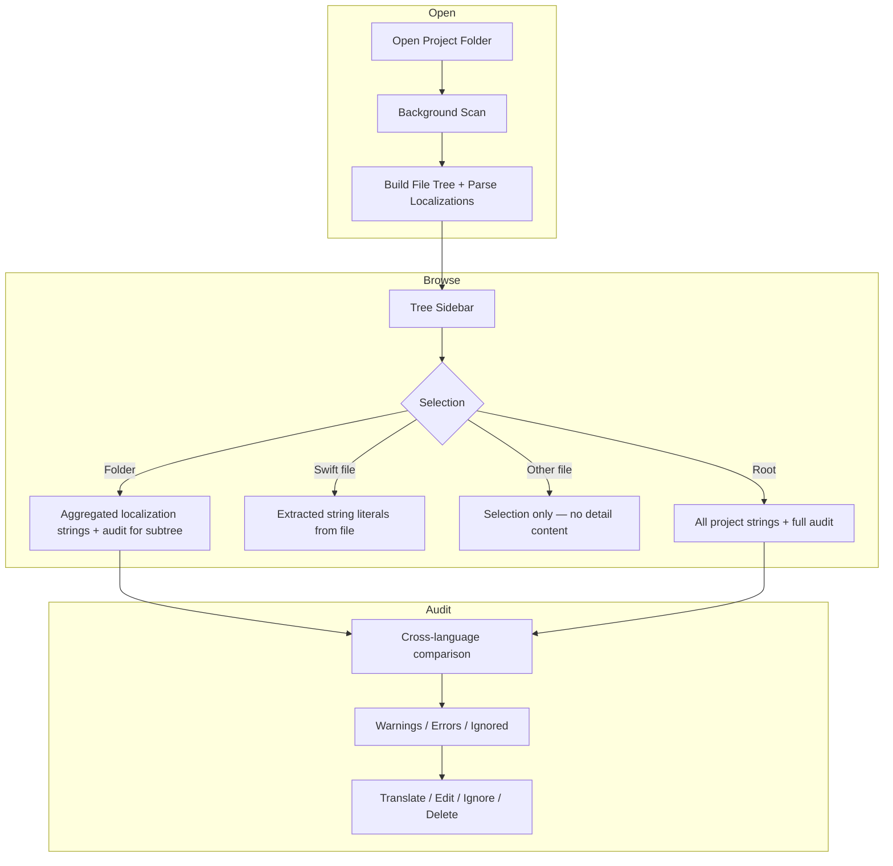

# LocalizerHelper — Product & Architecture Plan

> Reference document for implementation. Approved scope as of June 2026.

## Implementation progress

> **Last updated:** 2026-07-02 — Phases 0–7 fully implemented, including AI translation, menu commands, and settings. Bug fixes in progress.

| Phase | Status | Notes |
|-------|--------|-------|
| 0 Shell & open folder | Done | Security-scoped access on open; bookmark helpers in `ProjectStore` |
| 1 Swift extraction | Done | Lightweight tokenizer (no SwiftSyntax); filters images, colors, hex, logging |
| 2 Localization parsing | Done | `LocalizationKey` lives in `LocalizationEntry.swift` |
| 3 Audit & detail UI | Done | Search + filter wired in toolbar area |
| 4 Ignore list & store | Done | Global ignore list (`GlobalIgnoreStore`) with per-language support; inline editing & saving |
| 5 Polish | Done | Background scan + cancel on re-open; recent projects auto-open on launch |
| 6 AI & Translation | Done | 6 AI providers + 3 free fallbacks; batch translation; comment generation; bulk import |
| 7 Menu Commands & Settings | Done | `AppCommands` (File + View menus); Settings window (AI config, ignored keys) |
| 8 Bug Fixes | In Progress | Fixing critical bugs and code quality issues (see section 14) |

**Build note:** Project uses `PBXFileSystemSynchronizedRootGroup` — new files under `LocalizerHelper/` are picked up automatically by Xcode.

---

## 1. Overview

**LocalizerHelper** is a macOS-only SwiftUI app that helps developers audit localization in Xcode projects. The user opens a project folder, browses its file tree, inspects string literals in Swift source, and reviews localization coverage across `.strings` and `.xcstrings` files with warnings and errors. Translations can be generated automatically via AI or free translation services and saved directly back to the source files.

**Platform:** macOS only (developers work on Mac).

**Originally deferred, now implemented:**

- AI-assisted translation (Claude, OpenAI, Gemini, Ollama, LM Studio, MLX)
- Inline editing of `.strings` and `.xcstrings` files
- Developer comment generation from source context
- Bulk string import from Swift literals
- macOS menu bar commands (File + View menus)
- Settings window (AI provider config, ignored keys management)

**Still out of scope (v1):**

- iOS / iPad builds
- Export (CSV, JSON, markdown reports)
- Swift ↔ localization key cross-reference

---

## 2. Goals

| Goal | Description |
|------|-------------|
| **Open project** | Pick any folder via `NSOpenPanel`; recursively index the tree |
| **File explorer** | Show full folder structure (all files); familiar tree UX |
| **Swift string preview** | On Swift file selection, list string literals from source |
| **Localization audit** | Parse `.strings` / `.xcstrings`, compare across languages |
| **Actionable issues** | Warnings and errors with per-project ignore list |
| **Project memory** | Identify projects by folder / scheme name; persist ignores locally |
| **Translation** | Auto-translate missing keys via AI or free services |
| **Inline editing** | Save translation changes directly back to `.strings` / `.xcstrings` |
| **Menu commands** | Standard macOS menu bar with keyboard shortcuts for common actions |

---

## 3. User flows



### 3.1 Open project

1. User clicks **Open Project** in toolbar or uses File > Open Project… (Cmd+O).
2. `NSOpenPanel` (folder only).
3. App scans recursively on a background queue.
4. Tree populates; localization catalog builds in parallel.
5. Security-scoped bookmark saved so app can reopen on next launch without user re-granting access.

### 3.2 Select folder or root

- Detail panel shows:
  - **Strings sections** grouped by source file (`.strings` / `.xcstrings`).
  - Each entry: key, English value, translations per language where present.
  - **Audit badges** on each key (OK / warning / error / ignored).
  - Inline translation editing; AI batch-translate button.

### 3.3 Select Swift file

- Detail panel shows **string literals** extracted from that file.
- Indicates which literals are **missing** from the localization catalog.
- **Bulk Add** button: batch-create localization entries for missing strings, with optional AI or free translation.

### 3.4 Select non-Swift, non-folder file

- Tree selection only; detail panel shows empty state or brief file info. No file content viewer.

---

## 4. Scanning rules

### 4.1 Inclusion

- **All files and folders** appear in the tree (full project shape).

### 4.2 Excluded directories (skip recursion)

| Name | Reason |
|------|--------|
| `Pods` | Third-party CocoaPods dependencies |
| `DerivedData` | Build artifacts |
| `.git` | Version control metadata |
| `build` / `.build` | Build output |
| `Carthage` | Carthage dependencies |

### 4.3 Parsed file types (background)

| Extension | Parser | Visible in tree |
|-----------|--------|-----------------|
| `.swift` | String literal extractor | Yes |
| `.strings` | Key/value parser | Yes |
| `.xcstrings` | JSON String Catalog parser | Yes |
| Everything else | None | Yes (display only) |

---

## 5. Parsing & data models

### 5.1 File tree

```swift
struct FileNode: Identifiable, Hashable {
    let id: URL         // URL used as stable identity
    let name: String
    let url: URL
    let isDirectory: Bool
    var children: [FileNode]
    var fileKind: FileKind
}

enum FileKind {
    case directory
    case swift
    case strings
    case xcstrings
    case other
}
```

Built depth-first; sorted directories-first then alphabetically. Excluded dirs are skipped entirely.

### 5.2 Localization model

```swift
struct LocalizationKey: Hashable, Codable {
    let key: String
    let tableName: String   // e.g. "Localizable", "InfoPlist"
}

struct LocalizationEntry: Identifiable {
    let id: UUID
    let key: LocalizationKey
    let language: String    // BCP-47-ish: "en", "de", …
    let value: String
    let sourceFile: URL
    let comment: String?    // developer comment from .xcstrings
}

struct LocalizationCatalog {
    var entries: [LocalizationEntry]
    // Computed: entries grouped by key, by file, by language
}
```

**English sources:** `en.lproj` and `Base.lproj` are both treated as **English (base)**.

**Dedup within one file:** Same key appearing multiple times → last wins (mirrors runtime).

### 5.3 Swift string literal extraction

Extract text inside double-quoted Swift string literals for display when a `.swift` file is selected.

| Case | Example | Display approach |
|------|---------|------------------|
| Plain literal | `"Hello"` | `Hello` |
| Interpolation prefix | `"\(name) welcome"` | `{name} welcome` |
| Interpolation suffix | `"Welcome \(name)"` | `Welcome {name}` |
| Multiple interpolations | `"\(a) and \(b)"` | `{a} and {b}` |
| Escaped quotes | `"Say \"hi\""` | `Say "hi"` |
| Multiline `"""` | Block strings | Extract static segments; mark interpolations |
| Images / Colors | `Image("logo")` or `.color("bg")` | **Skipped** (detected via preceding call symbol/label) |
| Hex strings | `"#f023ff"` or `"#fff"` | **Skipped** (hex pattern matching) |
| Print / Logging | `print("msg")`, `Logger.debug(...)` | **Skipped** (detected via enclosing call name) |

```swift
struct SwiftStringLiteral: Identifiable {
    let id: UUID
    let raw: String            // Original source snippet
    let displayPattern: String // Human-readable with {placeholders}
    let hasInterpolation: Bool
    let lineNumber: Int
    let sourceLine: String     // Full trimmed source line for context
}
```

**Localization template:** `localizationTemplate` converts Swift `\(expr)` to printf-style `%1$@`, `%2$@` for use as localization key values.

### 5.4 `.strings` parser

- Parse `"key" = "value";` lines.
- Skip comments (`//`, `/* */`).
- Handle escaped characters (`\n`, `\t`, `\r`, `\"`, `\\`).
- **Encoding detection:** Tries UTF-8, UTF-16 LE/BE, macOS Roman, ISO-Latin-1.
- Infer `tableName` from filename; `language` from parent `.lproj` folder.

### 5.5 `.xcstrings` parser

- Decode JSON (String Catalog format).
- For each key in `strings`, read `localizations[language].stringUnit.value` and `comment`.
- `tableName` from filename. Language `Base` → `"en"`.

---

## 6. Audit rules

Base language: **English** (`en`, `Base.lproj`).

| Severity | Rule ID | Condition | Message (example) |
|----------|---------|-----------|-------------------|
| **Error** | `missing_translation` | Value in language X is **empty** | `"welcome_title" is empty in de` |
| **Error** | `untranslated_copy` | Value in language X **equals** English value | `"welcome_title" in de matches English` |
| **Warning** | `missing_language` | Key absent in language X | `"welcome_title" missing in de.lproj/Localizable.strings` |
| **Warning** | `duplicate_across_files` | Same key in **different** table files | `"app_name" in Localizable and InfoPlist` |
| **Ignored** | — | Key in global ignore list | Shown dimmed; not counted in error totals |

**Global ignore list:**
- User can mark keys as ignored globally (optionally per-language) via right-click or settings.
- Persisted per-device in `Application Support/LocalizerHelper/global_ignores.json`.

---

## 7. Translation

### 7.1 Providers

| Tier | Provider | Type |
|------|----------|------|
| AI | Claude (Anthropic) | Cloud API |
| AI | OpenAI (GPT-4o mini) | Cloud API |
| AI | Google Gemini | Cloud API |
| AI | Ollama | Local server |
| AI | LM Studio | Local server |
| AI | MLX | Local server |
| Free | Google Translate (unofficial) | Web scrape |
| Free | MyMemory | Free API |
| Free | LibreTranslate | Open-source API |

### 7.2 Strategy

- If an AI provider is configured with a key: try AI first, fall back to free chain on failure.
- Free chain order: ≤2 words → Google → MyMemory → LibreTranslate; 3+ words → MyMemory → Google → LibreTranslate.
- **Batch AI translation:** Single API call translates one key to all target languages at once.
- **Placeholder protection:** Swift interpolations and printf-style `%@`, `%d`, etc. are replaced with `__PH0__` tokens before translation and restored after.

### 7.3 Comment generation

- AI-powered: given the source Swift line and the key name, generates a developer comment describing what the string is for.
- Stored in `.xcstrings` comment field.

---

## 8. UI architecture (macOS)

### 8.1 Layout

`NavigationSplitView` with two zones:

```
┌───────────────────────────────────────────────────────────────┐
│  Menu Bar: File (Open, Refresh) | View (Localizable, Filter)  │
├───────────────────────────────────────────────────────────────┤
│  Toolbar: Open Project | Refresh | Add Language | Localizable │
│           Search | Scope | Match Case | Whole Word            │
├──────────────┬────────────────────────────────────────────────┤
│              │  Header: selected path + issue summary chips   │
│  File Tree   │  ─────────────────────────────────────────────│
│  (sidebar)   │  Detail content:                               │
│              │   • Folder/Root → Localization sections        │
│              │   • Swift file → String literals list          │
│              │   • Other → Empty / minimal info               │
└──────────────┴────────────────────────────────────────────────┘
```

### 8.2 Menu bar commands

Implemented via `AppCommands` using `FocusedValues` to bridge the ViewModel:

**File menu** (replaces default "New"):
- Open Project… (Cmd+O)
- Refresh Project (Cmd+R)

**View menu** (new):
- View Localization File (Cmd+L) — single item or submenu for multiple files
- Add Language…
- Show All Strings (Cmd+1)
- Show Errors Only (Cmd+2)
- Show Warnings Only (Cmd+3)
- Show Ignored Only (Cmd+4)
- Show AI Ready Only (Cmd+5)

### 8.3 Settings window

Opened via Cmd+, (standard macOS convention). Two tabs:
- **AI Translation:** Provider picker, API key fields (Keychain-backed), local server URL + model picker
- **Ignored Keys:** Table of all globally ignored keys with delete support

### 8.4 Detail — localization view (folder / root)

Sections per source file:

```
▼ Localizable.xcstrings
    welcome_title     "Welcome"    en ✓  de ✓  fr ⚠ missing
    settings_title    "Settings"   en ✓  de ✗ untranslated

▼ de.lproj / Localizable.strings
    …
```

- Expand row → edit translations inline; AI batch-translate button.
- Context menu / button: **Ignore**, **Delete**, **Edit Comment**.
- Top summary bar: `3 errors · 5 warnings · 2 ignored`

### 8.5 Detail — Swift strings view

| Pattern | Raw | Line | Status |
|---------|-----|------|--------|
| `{name} welcome` | `"\(name) welcome"` | 42 | Missing |

- **Bulk Add** button opens `BulkAddSheet` — select strings, pick target file, choose translation mode (none / free / AI), progress bar.

---

## 9. Project identification & persistence

### 9.1 Project identity

1. **Primary:** Name of exactly one `.xcodeproj` in the opened folder.
2. **Fallback:** Last path component of the selected URL.

### 9.2 Stored data

| Location | File | Contents |
|----------|------|----------|
| `Application Support/LocalizerHelper/` | `last-project.bookmark` | Security-scoped bookmark for auto-reopen |
| `Application Support/LocalizerHelper/` | `global_ignores.json` | `[{ "key": "AppName", "language": null }, …]` |
| Keychain | `com.LocalizerHelper.*` | Claude, OpenAI, Gemini API keys |
| UserDefaults | — | AI provider preference, local server URLs, model names |

---

## 10. Module structure

```
LocalizerHelper/
├── LocalizerHelperApp.swift
├── AppCommands.swift               // macOS menu bar (File + View menus)
├── AppleTranslator.swift           // On-device translation (disabled — NLTranslator unavailable)
├── AppleTranslateSupportedLanguages.swift
├── Models/
│   ├── FileNode.swift
│   ├── FileKind.swift
│   ├── LocalizationEntry.swift     // LocalizationKey, LocalizationEntry, LocalizationCatalog
│   ├── SwiftStringLiteral.swift
│   ├── AuditIssue.swift            // AuditSeverity, AuditRuleID, AuditIssue, KeyAuditResult, SearchScope, DetailFilter
│   ├── LanguageOption.swift        // All system-available BCP-47 language codes
│   ├── GlobalIgnoreEntry.swift     // Ignored key (key + optional language)
│   └── AISettings.swift            // AIProvider enum + AISettings singleton
├── Services/
│   ├── ProjectScanner.swift
│   ├── StringsParser.swift
│   ├── XCStringsParser.swift
│   ├── SwiftStringExtractor.swift
│   ├── LocalizationAuditor.swift
│   ├── ProjectStore.swift          // Project identity + bookmark persistence
│   ├── GlobalIgnoreStore.swift     // Observable singleton; persists global_ignores.json
│   ├── LocalizationFileUpdater.swift // Edit/save .strings & .xcstrings
│   └── TranslationService.swift    // AI + free translation (6 providers + 3 free services)
├── ViewModels/
│   └── ProjectViewModel.swift
└── Views/
    ├── ContentView.swift
    ├── ProjectTreeView.swift
    ├── LocalizationDetailView.swift
    ├── SwiftStringsDetailView.swift
    ├── AuditSummaryView.swift
    ├── AuditBadgeView.swift
    ├── EmptySelectionView.swift
    ├── AddLanguageView.swift       // Add new language to localization files
    ├── BulkAddSheet.swift          // Batch import Swift literals into localization
    └── Settings/
        ├── SettingsView.swift      // Tab container (AI Translation, Ignored Keys)
        ├── AISettingsView.swift
        └── IgnoredKeysSettingsView.swift
```

---

## 11. Implementation phases

### Phase 0 — Shell & open folder

- [x] `NSOpenPanel` + security-scoped bookmark
- [x] `ProjectScanner` with exclusion rules (Pods, DerivedData, .git, build, Carthage)
- [x] `FileNode` tree in sidebar with sort order (dirs first, then alpha)
- [x] Selection state wired to detail placeholder

### Phase 1 — Swift string extraction

- [x] `SwiftStringExtractor` with interpolation-aware tokenizer
- [x] `SwiftStringsDetailView` with line numbers and raw snippets
- [x] Filter: Image/Color calls, hex strings, logging calls

### Phase 2 — Localization parsing

- [x] `StringsParser` (multi-encoding) + `XCStringsParser`
- [x] `LocalizationCatalog` aggregation
- [x] English = `en` + `Base`; within-file deduplication (last wins)

### Phase 3 — Audit & detail UI

- [x] `LocalizationAuditor` (all 4 rule IDs)
- [x] `LocalizationDetailView` with per-file sections
- [x] Issue summary chips and row badges
- [x] Search (text, match-case, whole-word, scope) and filter (all/errors/warnings/ignored/aiReady)

### Phase 4 — Ignore list & project store

- [x] `GlobalIgnoreStore` with per-language support, persisted to JSON
- [x] Ignore/unignore UI (context menu + button in row detail)
- [x] `IgnoredKeysSettingsView` for bulk management

### Phase 5 — Polish

- [x] Recent projects: auto-open last project on launch via security-scoped bookmarks
- [x] Background scan with task cancellation on re-open
- [x] `LocalizationFileUpdater`: inline edit + save for `.strings` and `.xcstrings`
- [x] Create new localization file from within the app (save panel)
- [x] Add Language: creates new `.lproj` or adds language to `.xcstrings`

### Phase 6 — AI & Translation

- [x] `TranslationService` with 6 AI providers and 3 free service fallbacks
- [x] Placeholder protection (Swift interpolations and printf-style markers)
- [x] Single-key translation in localization detail row
- [x] Batch AI translation (one call → all languages)
- [x] Developer comment generation from source line context
- [x] `BulkAddSheet`: batch import Swift literals with optional translation
- [x] `AISettingsView`: provider picker, API key fields (Keychain), local server config
- [x] `LanguageOption.all`: dynamic list from system `Locale`

### Phase 7 — Menu Commands & Settings

- [x] `AppCommands`: File menu (Open, Refresh) and View menu (Localization File, Add Language, filter shortcuts)
- [x] `FocusedValues` bridge connecting ViewModel to menu items
- [x] `SettingsView` (Cmd+,): tabbed settings window registered in app scene

### Future (explicitly deferred)

- Export audit report (CSV, JSON, markdown)
- Swift ↔ localization key cross-reference
- Apple on-device translation (`AppleTranslator.swift` exists but disabled)
- iOS / iPad targets

---

## 12. Technical constraints

| Topic | Approach |
|-------|----------|
| **Sandbox** | App Sandbox; `com.apple.security.files.user-selected.read-only` |
| **Concurrency** | `Task` / actor for scan and parse; `@MainActor` ViewModel; `@Observable` |
| **xcstrings + strings** | Both parsed; same table in both formats shown as separate sources |
| **Language list** | Discovered dynamically from `.lproj` folders and xcstrings localizations |
| **API key storage** | Keychain (`SecItemAdd` / `SecItemCopyMatching`) |
| **Menu bridge** | `FocusedValues` + `@FocusedValue` in `Commands` struct |

---

## 14. Bug fixes in progress (2026-07-02)

### Critical fixes (High Priority)

| # | Issue | File | Status |
|---|-------|------|--------|
| 1 | Regex bug in replaceStringsValue() - character class `[^\"\]` should be `[^\"\\]` | LocalizationFileUpdater.swift:428 | ✅ Done |
| 2 | Replace print() statements with proper Logger calls | Multiple files | ✅ Done |
| 3 | Race condition in TranslationService.test() - mutates shared settings | TranslationService.swift:48-60 | ✅ Done |

### Code quality improvements (Medium Priority)

| # | Issue | File | Status |
|---|-------|------|--------|
| 4 | Add keyboard shortcuts (Cmd+O, Cmd+R, Cmd+F, etc.) | ContentView.swift | ✅ Done |
| 5 | Implement search debouncing (300-500ms) | ProjectViewModel.swift | ✅ Done |
| 6 | Add URL validation for local server addresses | AISettingsView.swift | ✅ Done |
| 7 | Standardize error display across the app | Multiple files | Pending |

### Code quality improvements (Low Priority)

| # | Issue | File | Status |
|---|-------|------|--------|
| 8 | Extract long runBulkTranslation() method (84 lines) | ProjectViewModel.swift:652-736 | ✅ Done |

---

## 13. Decision log

| Question | Decision |
|----------|----------|
| Platform | macOS only |
| Base language | Always English; `en.lproj` + `Base.lproj` |
| Tree content | All files |
| Click behavior | Selection updates detail; no raw file editor |
| Swift file detail | List of `""` literals with interpolation patterns |
| Strings files | Background parse only |
| Exclusions | Pods, DerivedData, .git, build, .build, Carthage |
| Same as English | Error; ignorable per key (global, optional per-language) |
| Duplicate key same file | Show once (last wins) |
| Duplicate key different files | Warning |
| AI translation | Implemented (Claude, OpenAI, Gemini, Ollama, LM Studio, MLX) |
| Free translation fallback | 3 services (Google, MyMemory, LibreTranslate) |
| Placeholder safety | Swift `\(...)` and printf `%@/%d` tokenized before translation |
| API key storage | Keychain (not UserDefaults) |
| Project identity | `.xcodeproj` name if exactly one found, else root folder name |
| Menu commands | `AppCommands` with `FocusedValues` bridge |
| Settings | Registered as `Settings` scene; opened via Cmd+, |
| Export | Deferred |

---

*End of plan.*
