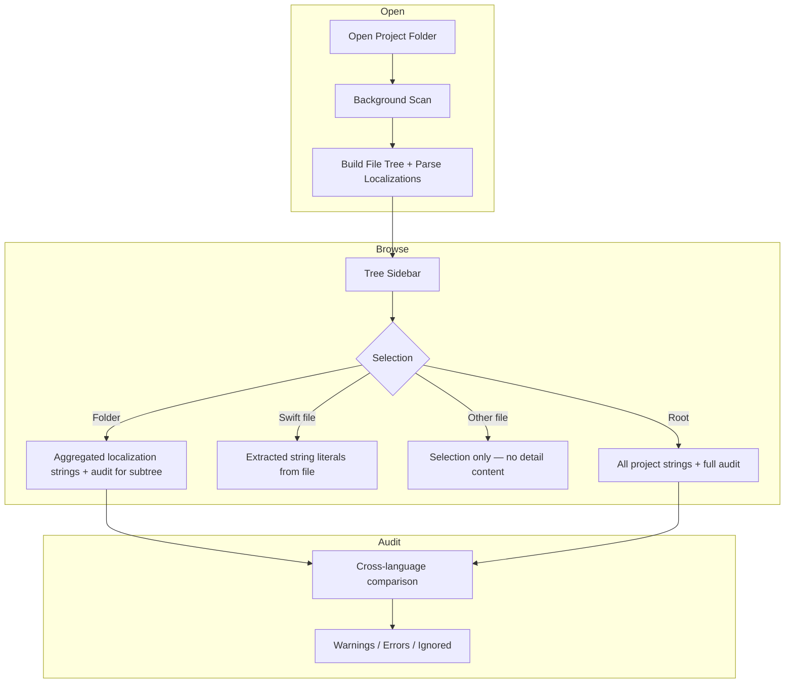

# LocalizerHelper — Product & Architecture Plan

> Reference document for implementation. Approved scope as of June 2026.

## 1. Overview

**LocalizerHelper** is a macOS-only SwiftUI app that helps developers audit localization in Xcode projects. The user opens a project folder, browses its file tree, inspects string literals in Swift source, and reviews localization coverage across `.strings` and `.xcstrings` files with warnings and errors.

**Platform:** macOS only (developers work on Mac).

**Not in scope (v1):**

- iOS / iPad builds
- Editing or writing localization files
- AI-assisted translation
- Export (CSV, JSON, markdown reports)
- Scanning `Pods`, `DerivedData`, or `.git`

---

## 2. Goals

| Goal | Description |
|------|-------------|
| **Open project** | Pick any folder via `NSOpenPanel`; recursively index the tree |
| **File explorer** | Show full folder structure (all files); familiar tree UX |
| **Swift string preview** | On Swift file selection, list string literals from source |
| **Localization audit** | Parse `.strings` / `.xcstrings`, compare across languages |
| **Actionable issues** | Warnings and errors with per-project ignore list |
| **Project memory** | Identify projects by folder / scheme name; persist ignores locally |

---

## 3. User flows



### 3.1 Open project

1. User clicks **Open Project** in toolbar.
2. `NSOpenPanel` (folder only, can choose files inside).
3. App scans recursively on a background queue.
4. Tree populates; localization catalog builds in parallel.

### 3.2 Select folder or root

- Selection highlights the node (opening/displaying the raw file is **not** required).
- Detail panel shows:
  - **Strings sections** grouped by source file (`.strings` / `.xcstrings`).
  - Each entry: key, English value, translations per language where present.
  - **Audit badges** on each key (OK / warning / error / ignored).

### 3.3 Select Swift file

- Detail panel shows **string literals** extracted from that file.
- Includes smart handling of interpolated strings (see §5.3).
- Optional cross-link later: mark whether each literal appears to map to a localization key (out of scope for strict v1 unless trivial).

### 3.4 Select non-Swift, non-folder file

- Tree selection only; detail panel shows empty state or brief file info (name, path). No file content viewer.

---

## 4. Scanning rules

### 4.1 Inclusion

- **All files and folders** appear in the tree (full project shape).

### 4.2 Excluded directories (skip recursion)

| Name | Reason |
|------|--------|
| `Pods` | Third-party; not project localizations |
| `DerivedData` | Build artifacts |
| `.git` | Version control metadata |

### 4.3 Parsed file types (background)

| Extension | Parser | Visible in tree |
|-----------|--------|-----------------|
| `.swift` | String literal extractor | Yes |
| `.strings` | Key/value parser | Yes |
| `.xcstrings` | JSON String Catalog parser | Yes |
| Everything else | None | Yes (display only) |

---

## 5. Parsing & data models

### 5.1 File tree

```swift
struct FileNode: Identifiable, Hashable {
    let id: UUID
    let name: String
    let url: URL
    let isDirectory: Bool
    var children: [FileNode]
    var fileKind: FileKind
}

enum FileKind {
    case directory
    case swift
    case strings
    case xcstrings
    case other
}
```

Built depth-first; folders included if they contain any children after filtering excluded dirs.

### 5.2 Localization model

```swift
struct LocalizationKey: Hashable {
    let key: String
    let tableName: String   // e.g. "Localizable", "InfoPlist"
}

struct LocalizationEntry: Identifiable {
    let id: UUID
    let key: LocalizationKey
    let language: String    // BCP-47-ish: "en", "de", …
    let value: String
    let sourceFile: URL
}

struct LocalizationCatalog {
    var entries: [LocalizationEntry]
    // Computed: entries grouped by key, by file, by language
}
```

**English sources:** `en.lproj` and `Base.lproj` are both treated as **English (base)**.

**Dedup within one file:** If the same key appears multiple times in a single `.strings` or `.xcstrings` file, keep **one** entry (last wins or first wins — document choice in implementation; prefer last wins as it mirrors runtime).

### 5.3 Swift string literal extraction

Extract text inside double-quoted Swift string literals for display when a `.swift` file is selected.

**Must handle:**

| Case | Example | Display approach |
|------|---------|------------------|
| Plain literal | `"Hello"` | `Hello` |
| Interpolation prefix | `"\(name) welcome"` | `{name} welcome` or `\(name) welcome` with label “contains variable” |
| Interpolation suffix | `"Welcome \(name)"` | `Welcome {name}` |
| Multiple interpolations | `"\(a) and \(b)"` | `{a} and {b}` |
| Escaped quotes | `"Say \"hi\""` | `Say "hi"` |
| Multiline `"""` | Block strings | Extract static segments; mark interpolations |

**Implementation note:** Prefer SwiftSyntax or regex/heuristic tokenizer. For v1, a focused lexer that tracks `"` / `"""` and `\(...)` regions is acceptable. Show a **pattern** string for interpolated literals rather than hiding them.

```swift
struct SwiftStringLiteral: Identifiable {
    let id: UUID
    let raw: String           // Original source snippet
    let displayPattern: String // Human-readable with placeholders
    let hasInterpolation: Bool
    let lineNumber: Int
}
```

### 5.4 `.strings` parser

- Parse `"key" = "value";` lines.
- Skip comments (`//`, `/* */`).
- Handle escaped characters inside keys and values.
- Infer `tableName` from filename (e.g. `Localizable.strings` → `Localizable`).
- Infer `language` from parent `.lproj` folder (`de.lproj` → `de`; `Base.lproj` / `en.lproj` → `en`).

### 5.5 `.xcstrings` parser

- Decode JSON (String Catalog format).
- Read `sourceLanguage` metadata (informational; **audit base is always English** per product rule).
- For each key in `strings`, read `localizations[language].stringUnit.value`.
- `tableName` from filename (e.g. `Localizable.xcstrings`).

---

## 6. Audit rules

Base language: **English** (`en`, `Base.lproj`).

For each localization key (scoped to a **table**), compare English value against every other language found in the project for that table.

| Severity | Rule ID | Condition | Message (example) |
|----------|---------|-----------|-------------------|
| **Error** | `missing_translation` | Key exists in English but value in language X is **empty** | `"welcome_title" is empty in de` |
| **Error** | `untranslated_copy` | Value in language X **equals** English value (non-ignored) | `"welcome_title" in de matches English — missing translation` |
| **Warning** | `missing_language` | Key exists in English but **absent** in language X | `"welcome_title" missing in de.lproj/Localizable.strings` |
| **Warning** | `duplicate_across_files` | Same key appears in **different** localizable files (tables) | `"app_name" appears in Localizable and InfoPlist` |
| **Ignored** | — | User added key to project ignore list | Shown dimmed / filterable, not counted in error totals |

**Ignore list:**

- User can mark specific keys (per table) as ignored for `untranslated_copy` checks (e.g. brand names).
- Persisted **per project** (see §8).

**Duplicate keys:**

- Same key twice in **one** file → single displayed entry (no duplicate issue).
- Same key in **different** tables/files → **warning** (`duplicate_across_files`).

---

## 7. UI architecture (macOS)

### 7.1 Layout

`NavigationSplitView` with three conceptual zones:

```
┌─────────────────────────────────────────────────────────────┐
│  Toolbar: Open Project | Search | Filter (All/Issues/…)    │
├──────────────┬──────────────────────────────────────────────┤
│              │  Header: selected path + issue summary chips  │
│  File Tree   │  ─────────────────────────────────────────── │
│  (sidebar)   │  Detail content:                              │
│              │   • Folder/Root → Localization sections       │
│              │   • Swift file → String literals list         │
│              │   • Other → Empty / minimal info              │
│              │                                               │
└──────────────┴──────────────────────────────────────────────┘
```

### 7.2 Tree sidebar

- Collapsible folders, disclosure triangles.
- Icons by `FileKind` (folder, Swift, strings catalog, generic file).
- Single selection drives detail panel (no separate “open file” step).

### 7.3 Detail — localization view (folder / root)

Sections per source file:

```
▼ Localizable.xcstrings
    welcome_title          "Welcome"        en ✓  de ✓  fr ⚠ missing
    settings_title         "Settings"       en ✓  de ✗ untranslated

▼ de.lproj / Localizable.strings
    …
```

- Tap row → expand translations side-by-side or inline chips per language.
- Context menu or button: **Ignore this key** (adds to project ignore store).
- Top summary bar: `3 errors · 5 warnings · 2 ignored`

### 7.4 Detail — Swift strings view

List/table:

| Pattern | Raw | Line | Notes |
|---------|-----|------|-------|
| `{name} welcome` | `"\(name) welcome"` | 42 | Contains variable |

### 7.5 Visual design principles

- Native macOS spacing and materials (`sidebar`, `content` backgrounds).
- Semantic colors: red (error), orange (warning), green (OK), secondary (ignored).
- Monospace for keys and file paths; readable body font for values.
- Search filters tree and detail lists simultaneously.

---

## 8. Project identification & persistence

### 8.1 Project identity

Derive a stable **project ID** from:

1. **Primary:** Parent folder name of the opened directory (e.g. `MyApp` when opening `…/MyApp/`).
2. **Fallback:** Last path component of the selected URL.
3. **Optional enhancement:** Read `.xcodeproj` bundle name if exactly one exists in the opened folder (scheme-like name).

Use this ID as key for stored data.

### 8.2 Stored data (per project)

Location: `Application Support/LocalizerHelper/Projects/<projectID>/`

| File | Contents |
|------|----------|
| `ignored-keys.json` | `[{ "table": "Localizable", "key": "AppName" }, …]` |
| `last-opened.json` (optional) | Bookmark / path for recent projects |

Use security-scoped bookmarks if sandboxed access to reopened folders is required.

---

## 9. Module structure

```
LocalizerHelper/
├── App/
│   └── LocalizerHelperApp.swift
├── Models/
│   ├── FileNode.swift
│   ├── FileKind.swift
│   ├── LocalizationEntry.swift
│   ├── LocalizationKey.swift
│   ├── SwiftStringLiteral.swift
│   └── AuditIssue.swift
├── Services/
│   ├── ProjectScanner.swift
│   ├── StringsParser.swift
│   ├── XCStringsParser.swift
│   ├── SwiftStringExtractor.swift
│   ├── LocalizationAuditor.swift
│   └── ProjectStore.swift          // identity + ignore persistence
├── ViewModels/
│   └── ProjectViewModel.swift
└── Views/
    ├── ContentView.swift
    ├── ProjectTreeView.swift
    ├── LocalizationDetailView.swift
    ├── SwiftStringsDetailView.swift
    ├── AuditSummaryView.swift
    ├── AuditBadgeView.swift
    └── EmptySelectionView.swift
```

---

## 10. Implementation phases

### Phase 0 — Shell & open folder

- [ ] `NSOpenPanel` + security-scoped bookmark (if sandboxed)
- [ ] `ProjectScanner` with exclusion rules
- [ ] `FileNode` tree in sidebar
- [ ] Selection state wired to empty detail placeholder

### Phase 1 — Swift string extraction

- [ ] `SwiftStringExtractor` with interpolation-aware patterns
- [ ] `SwiftStringsDetailView` for `.swift` selection
- [ ] Line numbers and raw snippet display

### Phase 2 — Localization parsing

- [ ] `StringsParser` + `XCStringsParser`
- [ ] `LocalizationCatalog` aggregation
- [ ] English = `en` + `Base`
- [ ] Within-file deduplication

### Phase 3 — Audit & detail UI

- [ ] `LocalizationAuditor` (all rule IDs)
- [ ] Folder/root detail with per-file sections
- [ ] Issue summary chips and row badges
- [ ] Search and filter (all / errors / warnings / ignored)

### Phase 4 — Ignore list & project store

- [ ] `ProjectStore` with project ID derivation
- [ ] Ignore key UI + persistence
- [ ] Ignored keys excluded from `untranslated_copy` errors

### Phase 5 — Polish

- [ ] Recent projects (optional)
- [ ] Performance: background scan, cancel on re-open
- [ ] Empty states, error toasts for unreadable files

### Future (explicitly deferred)

- Export audit report
- AI translation suggestions
- Swift ↔ localization key cross-reference
- Inline editing of `.strings` / `.xcstrings`
- iOS / iPad targets

---

## 11. Technical constraints

| Topic | Approach |
|-------|----------|
| **Sandbox** | Enable App Sandbox; `com.apple.security.files.user-selected.read-only` |
| **Concurrency** | `Task` / actor for scan and parse; `@MainActor` ViewModel |
| **xcstrings + strings** | Both parsed; same table in both formats treated as separate sources unless paths indicate otherwise — prefer showing both; duplicate-across-files warning applies |
| **Language list** | Discovered dynamically from `.lproj` folders and xcstrings localizations |

---

## 12. Decision log

| Question | Decision |
|----------|----------|
| Platform | macOS only |
| Base language | Always English; `en.lproj` + `Base.lproj` |
| Tree content | All files |
| Click behavior | Selection updates detail; no file editor |
| Swift file detail | List of `""` literals with interpolation patterns |
| Strings files | Background parse only |
| Exclusions | `Pods`, `DerivedData`, `.git` |
| Same as English | Error; ignorable per key per project |
| Duplicate key same file | Show once |
| Duplicate key different files | Warning |
| Export | Deferred |
| AI translation | Deferred |
| Project identity | Folder / xcodeproj name under Application Support |

---

## 13. Open implementation details (minor)

These can be decided during build without plan changes:

1. **Swift extractor:** SwiftSyntax package vs lightweight tokenizer (trade-off: accuracy vs dependency).
2. **Last-wins vs first-wins** for duplicate keys in one file (default: last wins).
3. **Recent projects** list in Phase 5 vs skipping for minimal v1.

---

*End of plan.*
